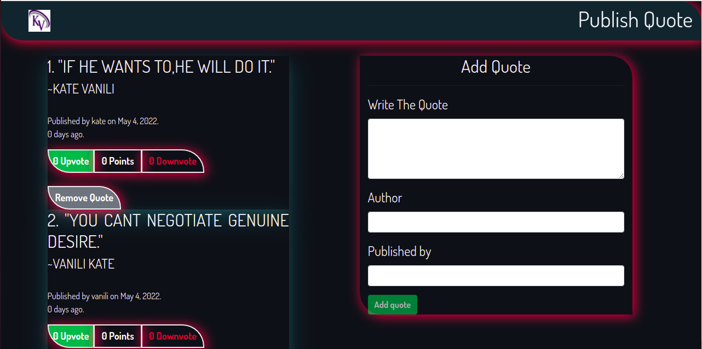

# Quote generator

This project is based on [Angular TypeScript Javascript CSS Bootsrap HTML](#TechStack).

The quote generator will allow the user to add a quote and have it displayed, they will be able to upvote and downvote the quote. Any quote with the highest upvotes will be highlighted. It will also show how long it has been since the quote was added. 

## Author
Kate Vanili

# Table of Content

-   [Prerequisites](#Prerequisites)
-   [Setup Environment](#Technologies)
-   [Application features](#features)
-   [Contribute]

## Prerequisites

---

Make sure you have a browser with javascript enabled.

## Technologies

---
-   Angular
-   TypeScript
-   Javascript
-   CSS
-   Bootstrap
-   HTML

### Setup Environment

1. Clone the repo : `git clone https://github.com/katevanili/akan-generator.git`
2. Run `npm install` in the folder.
3. Run `ng serve --open` to access the application on your web.

## Application features

---
-  Input quote
-  Output quote.
-  Upvote a quote
-  Downvote a quote.
-  See duration since the time was added.

